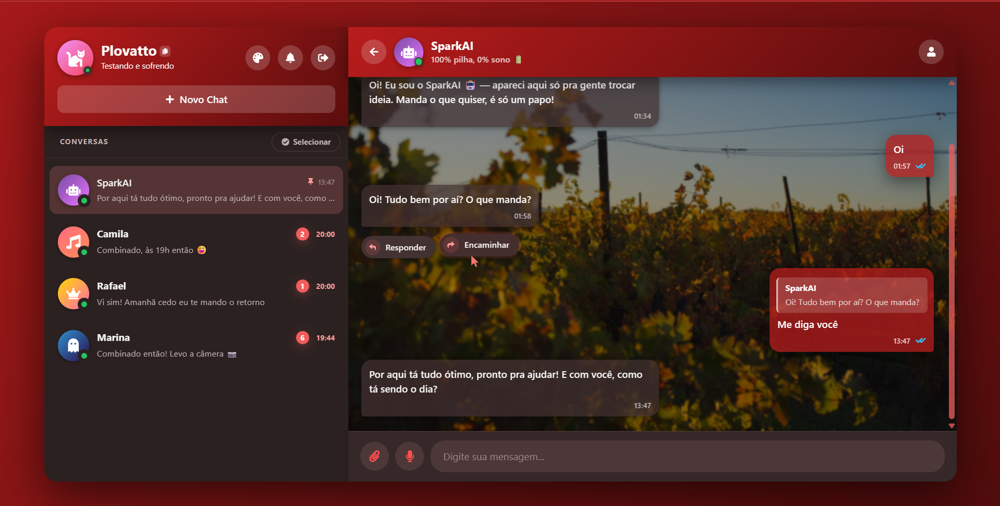
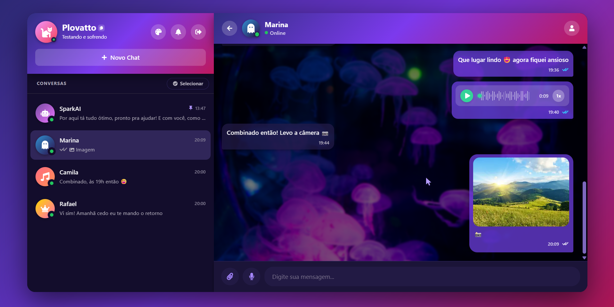
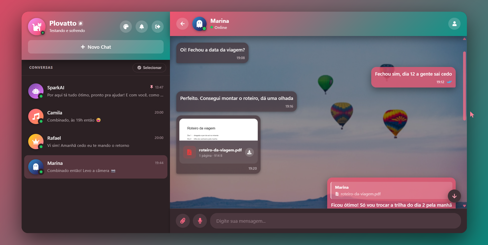

# SparkChat Web

[](https://github.com/Plovatto/SparkChat/actions/workflows/ci.yml)
[](https://github.com/Plovatto/SparkChat/actions/workflows/deploy-pages.yml)
[](LICENSE)

Interface do SparkChat, uma SPA desenvolvida com React, TypeScript e Vite para compor a experiência visual de uma aplicação de chat em tempo real.

**Acesse o app:** https://plovatto.github.io/SparkChat/ · **API:** https://p01--sparkchat--pgj2h2jjxzb4.code.run/docs/

<p align="center">
  
</p>

<p align="center"><em>Conversa com o SparkAI, o assistente integrado</em></p>

<table>
  <tr>
    <td width="50%"></td>
    <td width="50%"></td>
  </tr>
  <tr>
    <td align="center"><em>Mensagens de áudio e imagens</em></td>
    <td align="center"><em>Anexos com pré-visualização e respostas citadas</em></td>
  </tr>
</table>

<table>
  <tr>
    <td width="50%" align="center"></td>
    <td width="50%" align="center"></td>
  </tr>
  <tr>
    <td align="center"><em>Lista de conversas no celular</em></td>
    <td align="center"><em>Conversa com papel de parede</em></td>
  </tr>
</table>

## Funcionalidades

- SPA criada com React e Vite, organizada por domínios da aplicação
- Chat em tempo real com Socket.IO, com reautenticação automática a cada reconexão
- Criptografia ponta a ponta das mensagens e dos anexos no navegador
- Envio de imagens, áudios e arquivos, com miniatura gerada no cliente para a prévia da conversa
- Temas, papéis de parede e aparência dos balões sincronizados entre dispositivos
- Notificações do navegador, sons e badge de mensagens não lidas
- Alias de importação configurados no Vite

## Tecnologias

- [React](https://react.dev/) 19
- [TypeScript](https://www.typescriptlang.org/)
- [Vite](https://vite.dev/)
- [Bootstrap](https://getbootstrap.com/) 5
- [React Bootstrap](https://react-bootstrap.github.io/)
- [Socket.IO Client](https://socket.io/docs/v4/client-api/)
- [React Icons](https://react-icons.github.io/react-icons/)
- ESLint - análise e padronização do código

## Como Executar

### Pré-requisitos

Antes de começar, tenha instalado:

- [Node.js](https://nodejs.org/)
- npm

Para testar a integração completa, mantenha também a SparkChat API em execução.

### Instalação

Clone o repositório:

```bash
git clone https://github.com/Plovatto/SPA-SparkChat.git
```

Acesse a pasta do projeto:

```bash
cd SPA-SparkChat
```

Instale as dependências:

```bash
npm install
```

Crie o arquivo de variáveis de ambiente:

```bash
cp .env.example .env
```

Execute o servidor de desenvolvimento:

```bash
npm run dev
```

O projeto estará disponível em:

```text
http://localhost:5173
```

## Variáveis de Ambiente

As variáveis são definidas no arquivo `.env`, que não deve ser versionado.

Utilize `.env.example` como referência:

```env
VITE_API_URL=http://localhost:3001
VITE_SOCKET_URL=http://localhost:3001
```

## Integração com a API

Este projeto foi preparado para trabalhar junto com a [SparkChat API](../API-SparkChat).

Em ambiente local, a configuração esperada é:

```text
SPA: http://localhost:5173
API: http://localhost:3001
```

Caso a API esteja em outra URL, atualize `VITE_API_URL` e `VITE_SOCKET_URL` no arquivo `.env`.

## Deploy

O deploy é feito no GitHub Pages pelo workflow `.github/workflows/deploy-pages.yml`, disparado a cada push na branch `main`.

Duas configurações são necessárias no repositório:

- Em **Settings → Pages**, a origem deve estar como **GitHub Actions**.
- Em **Settings → Environments → github-pages**, os valores `VITE_API_URL` e `VITE_SOCKET_URL` devem apontar para a API hospedada. O Vite embute essas variáveis no build, então elas precisam existir no ambiente da Action, não apenas no `.env` local.

O `base` do Vite é definido como `/SparkChat/` apenas no build (o servidor de desenvolvimento continua na raiz), acompanhando o caminho do GitHub Pages.

A URL do frontend também precisa constar em `FRONTEND_URL` na API, que controla o CORS.

## Scripts

| Comando             | Descrição                                              |
| ------------------- | ------------------------------------------------------ |
| `npm run dev`       | Inicia o servidor de desenvolvimento                   |
| `npm run build`     | Executa a checagem de tipos e gera o build de produção |
| `npm run preview`   | Executa localmente o build de produção                 |
| `npm run typecheck` | Executa a checagem de tipos sem gerar arquivos         |
| `npm run lint`      | Executa a análise do código com ESLint                 |
| `npm run lint:fix`  | Corrige problemas de lint automaticamente              |

## Estrutura do Projeto

```text
src/
├── app/              # App principal, gate de autenticação e provider global
├── assets/           # Imagens, ícones e arquivos estáticos da aplicação
├── components/       # Componentes reutilizáveis de interface (modal, spinner, botões, etc.)
├── config/           # Leitura das variáveis de ambiente
├── constants/        # Constantes compartilhadas (ex.: breakpoints de layout)
├── features/
│   ├── auth/         # Login, cadastro, sessão e sincronização com o socket
│   ├── chat/         # Área de conversa, mensagens, anexos, efeitos e uploads
│   ├── notifications/# Notificações do navegador, sons e badge de não lidas
│   ├── rooms/        # Lista de conversas, perfil, novo chat e helpers de sala
│   └── theme/        # Temas, papéis de parede e aparência dos balões
├── hooks/            # Hooks reutilizáveis entre features
├── lib/              # Clientes de API, socket, E2EE, storage, áudio, mídia e formatação
├── styles/           # Estilos globais, animações e responsividade
├── types/            # Declarações de tipos globais
├── main.tsx
└── vite-env.d.ts
```
